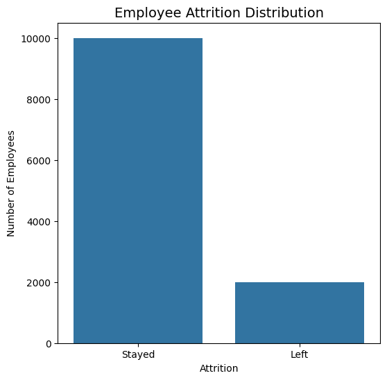
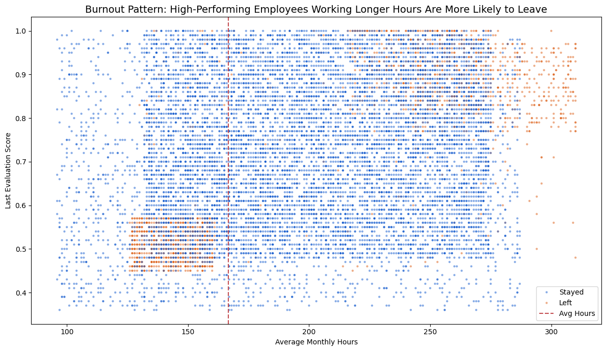
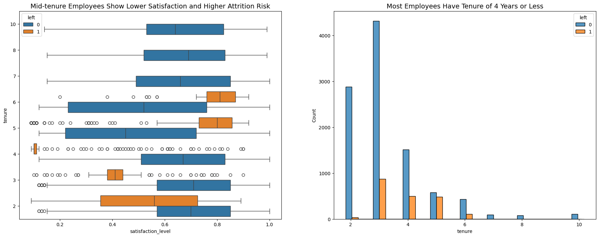
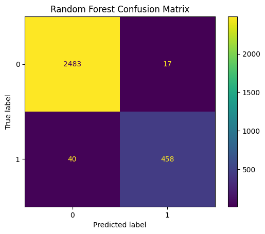

# Employee Attrition Analysis

## Overview

This project analyzes employee attrition using Python, exploratory data analysis, and machine learning to identify key drivers of employee turnover and predict attrition risk.

---

## Key Insights

* Attrition occurs in two groups: overworked high-performing employees and dissatisfied employees
* Higher working hours are strongly associated with attrition, indicating burnout
* Mid-tenure employees show lower satisfaction levels, suggesting a retention gap
* Salary is not the primary driver of retention

---

## Model Performance

* Decision Tree:

  * Low recall (~26%), misses most at-risk employees

* Random Forest:

  * Recall improved to ~92%
  * False negatives reduced significantly (348 → 40)
  * Much more reliable for identifying employees likely to leave

---

## Visual Insights

### Attrition Distribution

### Burnout Pattern (Workload vs Performance)

### Tenure vs Satisfaction

### Model Performance

---

## Tools Used

* Python (Pandas, NumPy)
* Matplotlib, Seaborn
* Scikit-learn

---

## Key Takeaway

Attrition is driven by both burnout among high performers and dissatisfaction among employees, indicating systemic issues in workload and engagement rather than compensation alone.
